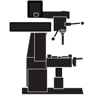
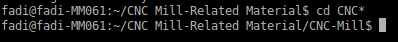

Description
===========
All Team Project I '[STL](http://en.wikipedia.org/wiki/STL_%28file_format%29) to [G-code](http://en.wikipedia.org/wiki/G-code)' cronvertsion-related material is/will be held in this repository.

How to Download
===============
Clone the project repository from GitHub

	$ git clone https://github.com/alkass/CNC-Mill

How to Build
============
1. Navigate to the CNC-Mill folder

	$ cd CNC*

3. Build the project

	$ sudo make

> Note: The build process will install all missing packages along the line.
> Note: Building the source code may take a while (15-30 minutes)

Usage
=====

Author(s) & Contributors
========================
[Fadi Hanna Al-Kass](http://fadialkass.blogspot.com)
