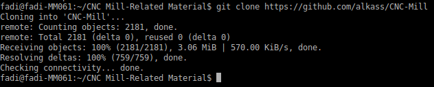
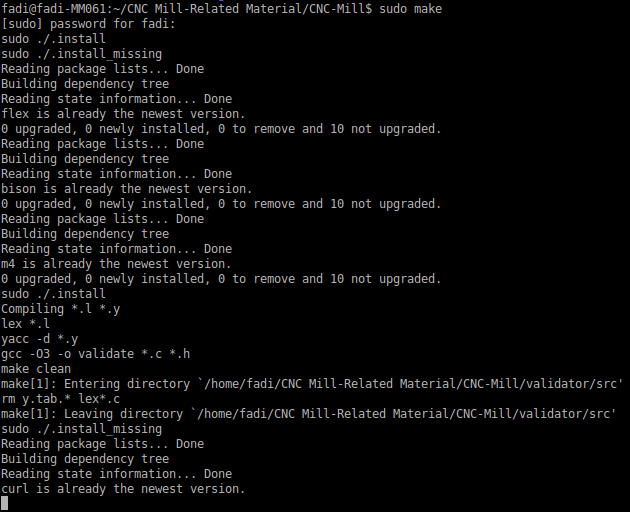
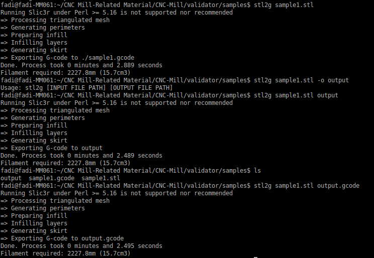

Description
===========
All Team Project I '[STL](http://en.wikipedia.org/wiki/STL_%28file_format%29) to [G-code](http://en.wikipedia.org/wiki/G-code)' cronvertsion-related material is/will be held in this repository.

How to Download
===============
Clone the project repository from GitHub

	$ git clone https://github.com/alkass/CNC-Mill

How to Build
============
Navigate to the CNC-Mill folder

	$ cd CNC*

Build the project

	$ sudo make

	
> Note: The build process will install all missing packages along the line.
> Note: Building the source code may take a while (15-30 minutes)

Usage
=====

To convert an .stl file into .gcode, type

	$ stl2g <file name>	# <file name> is the *.stl file path.

if you, however, want to specify your output file name, type

	$ stl2d <input file name> <output file name>

Author(s) & Contributors
========================
[Fadi Hanna Al-Kass](http://fadialkass.blogspot.com)
