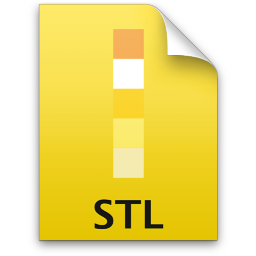

Description
===========
All Team Project I STL-to-Gcode Convertsion-Related Material is/will be Held in this Repository.

Necessary Packages
==================
* [m4](http://www.gnu.org/software/m4/)
* [flex Lexical Analyzer](https://www.gnu.org/software/flex/)
* [yacc Parser](http://en.wikipedia.org/wiki/Yacc)

> Note: To install all missing packages, run the included `install_missing` [Bash](http://www.gnu.org/software/bash) [script](http://en.wikipedia.org/wiki/Script_%28Unix%29), i.e.

	`sudo ./install_missing`

Author(s) & Contributors
========================
[Fadi Hanna Al-Kass](http://fadialkass.blogspot.com)
